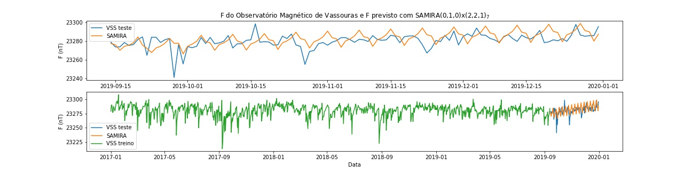

### SARIMA aplicado em dados do Observatório Magnético de Vassouras - ON
Souza, Gustavo.

O presente repositório é uma aplicação do Modelo de Previsão Autorregressivo Integrado  de  Média  Móvel Sazonal em dados magnéticos (série temporal). A motivação é puramente baseada em curiosidade e vontade de aprender.

Os resultados apresentados neste projeto pessoal baseiam-se nos dados cedidos pela International Real-time Magnetic Observatory Network (www.intermagnet.org), a qual agradeço.
