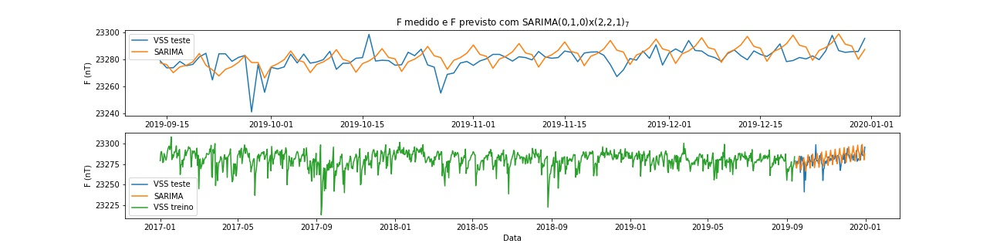
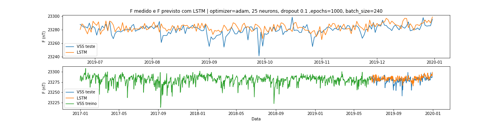

### Modelos de previsão aplicados em dados do Observatório Magnético de Vassouras - ON
Souza, Gustavo.

O projeto tem como motivação estudar os modelos de previsão para series temporais, se trata do primeiro contato do autor com o tema. O presente repositório contém uma aplicação do Modelo de Previsão Autorregressivo Integrado  de  Média  Móvel Sazonal e uma aplicação de redes neurais LSTM em dados magnéticos (série temporal). Os próximos passos envolvem o teste de diferentes modelos.

Os resultados apresentados neste projeto baseiam-se nos dados cedidos pela International Real-time Magnetic Observatory Network (www.intermagnet.org), a qual agradeço.
